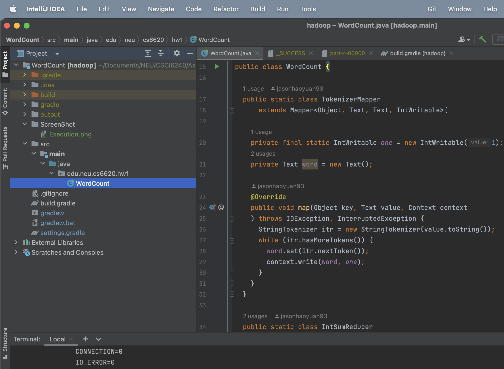
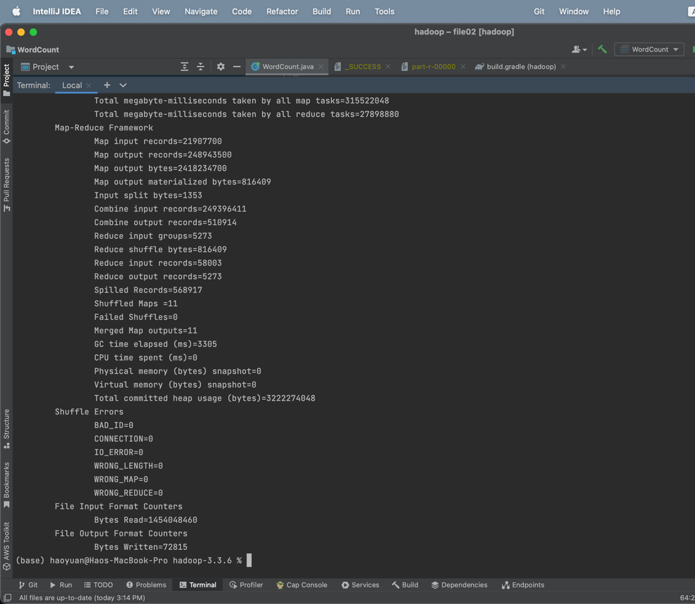

# CS6240 HW1 Hao Yuan
## Local Execution
Execute word count program in my local
### Project directory Structure Screen Shot

### Job Summary in IDE

## AWS Execution
Execute word count program in AWS using at least three small machines, i.e., one master node and two core nodes (those with HDFS) as workers.

Successfully executed step: 

With SysLog: 

